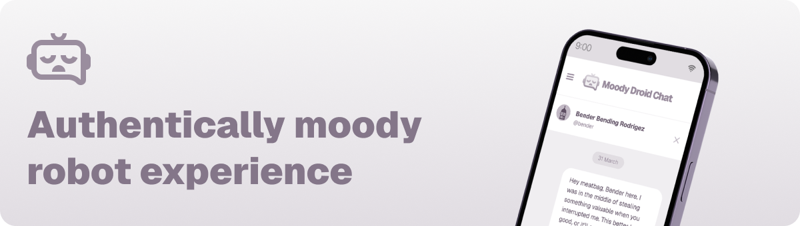

[](https://moodydroid.chat/)

# Moody Droid Chat

A fun, interactive chat application featuring moody robot characters from popular science fiction.

## Overview

Moody Droid Chat is an open-source project that allows users to engage in conversations with simulated personalities of famous fictional robots like Bender, Marvin the Paranoid Android, and HAL 9000. Unlike typical AI chat applications, these robots have fluctuating moods and won't always respond in a helpful manner.

## Technical Details

- **Framework**: Built with Next.js
- **AI Integration**: Powered by OpenAI API
- **Frontend**: React with TypeScript
- **Styling**: Tailwind CSS

## Prerequisites

- Node.js (v18.0.0 or higher)
- pnpm or yarn or npm
- OpenAI API key

## Installation

1. Clone the repository:

   ```
   git clone https://github.com/hypersnob/moody-droid-chat.git
   cd moody-droid-chat
   ```

2. Install dependencies:

   ```
   pnpm install
   ```

3. Create a `.env.local` file in the project root and add your OpenAI API key:

   ```
   OPENAI_API_KEY=your_api_key_here
   ```

4. Start the development server:

   ```
   pnpm run dev
   ```

5. Open your browser and navigate to `http://localhost:3000`

## Features

- Chat with multiple robot characters with distinct personalities
- Mood-based responses that change with each interaction
- Responsive design for mobile and desktop devices

## Disclaimer

This is a non-commercial, open-source project created for entertainment purposes only. All character rights belong to their respective owners. This application is not affiliated with or endorsed by the creators or rights holders of Bender, Marvin the Paranoid Android, HAL 9000, or any other fictional characters featured.

## Contributing

Contributions are welcome! Please feel free to submit a Pull Request.
